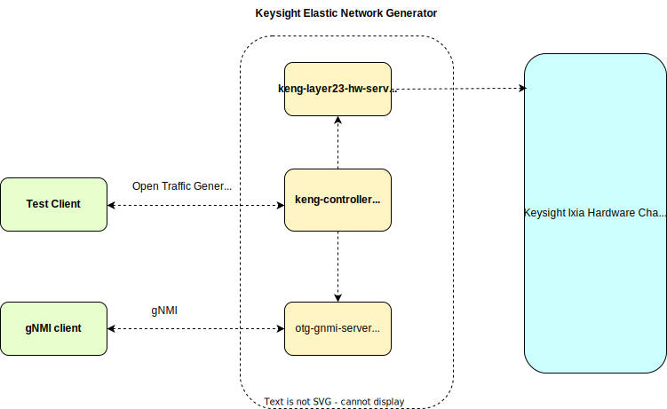

# Ixia Chassis/Appliances
 This section describes how to use KENG with Keysight's Ixia hardware chassis.

**Prerequisites**

To run KENG tests with Ixia hardware, the following pre-requisites must be satisfied:

- You must have access to Keysight Elastic Network Generator (KENG) images and a valid KENG license.
- For information on how to deploy and activate a KENG license, see the Licensing section of the User Guide.
- The test hardware must be Keysight Ixia Novus or AresOne [Network Test Hardware](https://www.keysight.com/us/en/products/network-test/network-test-hardware.html) with [IxOS](https://support.ixiacom.com/ixos-software-downloads-documentation) 9.20 Patch 4 or higher.
**NOTE:**  Currently, only Linux-based IxOS platforms are supported with KENG.
- There must be physical link connectivity between the test ports on the Keysight Ixia Chassis and the devices under test (DUTs).
- You must have a Linux host or virtual machine (VM) with sudo permissions and Docker support.

	Below is an example of deploying an Ubuntu VM otg using [multipass](https://multipass.run/).  You can deploy using the means that you are most familiar with.

	`multipass launch 22.04 -n otg -c4 -m8G -d32G`

	`multipass shell otg`

- [Docker](https://docs.docker.com/engine/install/ubuntu/). Depending on your Linux distribution, follow the steps outlined at one of the following URLs:
  - [Ubuntu](https://docs.docker.com/engine/install/ubuntu/)
  - [Debian](https://docs.docker.com/engine/install/debian/)
  - [CentOS](https://docs.docker.com/engine/install/centos/)

	After docker is installed, add the current user to the docker group:

	`sudo usermod -aG docker $USER`

- Python3 (version 3.9 or higher), pip and virtualenv

	Use the following command to install Python, pip, and virtualenv:

	`sudo apt install python3 python3-pip python3.10-venv -y`

- [Go](https://go.dev/dl/) version 1.19 or later, if gRPC or gNMI API access is needed.

	Use the following command to install Go:

	`sudo snap install go --channel=1.19/stable --classic`

- git and envsubst commands (typically installed by default)

	Use the following command to install git and envsubst if they are not already installed:

	`sudo apt install git gettext-base -y`

**Deployment Layout**

The image below shows a complete topology of a KENG test environment.

To run tests with KENG, the tests must be written using the  OpenTrafficGenerator (OTG) API.

Telemetry is also supported using gNMI APIs.

If KENG is deployed successfully, the services shown in the block labeled 'Keysight Elastic Network Generator' will be running.

KENG services interact with the Keysight Ixia hardware chassis to configure protocols and data traffic.



**Deploying KENG**

The Docker Compose tool provides a convenient way to deploy KENG services.

Tests cannot be run until KENG services are deployed and running.

The following procedure shows an example of how to deploy using Docker Compose.


1. Copy the contents shown below into a `compose.yaml` file.


```
services:
  keng-controller:
    image: ghcr.io/open-traffic-generator/keng-controller:1.4.0-1
    restart: always
    depends_on:
      keng-layer23-hw-server:
        condition: service_started
    command:
      - "--accept-eula"
      - "--debug"
      - "--keng-layer23-hw-server"
      - "keng-layer23-hw-server:5001"
    ports:
      - "40051:40051"
logging:
      driver: "local"
      options:
        max-size: "100m"
        max-file: "10"
        mode: "non-blocking"
  keng-layer23-hw-server:
    image: ghcr.io/open-traffic-generator/keng-layer23-hw-server:1.4.0-2
    restart: always
    command:
      - "dotnet"
      - "otg-ixhw.dll"
      - "--trace"
      - "--log-level"
      - "trace"
    logging:
      driver: "local"
      options:
        max-size: "100m"
        max-file: "10"
        mode: "non-blocking"
  otg-gnmi-server:
    image: ghcr.io/open-traffic-generator/otg-gnmi-server:1.13.18
    restart: always
    depends_on:
      keng-controller:
        condition: service_started
    command:
      - "-http-server"
      - "https://keng-controller:8443"
      - "--debug"
    ports:
      - "50051:50051"
logging:
      driver: "local"
      options:
        max-size: "100m"
        max-file: "10"
        mode: "non-blocking"
```

2. Start the Compose tool:

	`docker compose up -d`


3. Use the `docker ps` command to verify that KENG services are running:

	`docker ps`

The list of containers should include:
- `keng-controller`
- `keng-layer23-hw-server`
- `otg-gnmi-server`  (optional if gNMI access is needed)

When the controller and ixhw-server services are running, the deployment is ready to run a test.

**Test port references**

KENG uses '/config.ports.locations' parameter to determine the test ports involved in the test.

The ‘/config.ports.locations’ parameter needs to be set to reference a test port.

This parameter is to be specified in a ‘chassis ip;card;port’ format.

