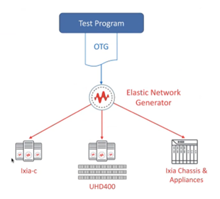

# Introduction 
Keysight Elastic Network Generator is a software test tool that runs in any containerized environment and emulates key data center control plane protocols while also sending data plane traffic. It has a modern architecture based on micro-services and open-source interfaces and is designed for very fast automated test scenario execution. All of these characteristics contribute to validating data center networks that deliver a top quality of experience and fuel continued public cloud growth.

## Components

The main components of KENG are:

| Component  | Description |
| ------------- | ------------- |
| Test program  | A script or other executable that contains the code that defines the test processes.  |
| OTG  | Open Traffic Generator, an evolving API specification that defines the components of a traffic generator such as: test ports (virtual or physical), emulated devices, traffic flows, and statistics and capture capability.  |
| Elastic Network Generator  | Controller that manages the flow of commands from the test program to the traffic generation device (virtual or physical) and the flow of results from the device to the test program.  |
| Ixia-c  | A containerized virtual traffic generator.  |
| UHD400  | A high-performance Keysight traffic generator.  |
| IxOS hardware  | Ixia chassis and appliances.  |

## Ixia-c Community Edition 

Ixia-c Community Edition is a free-to-use version of the Ixia-c container-based traffic generator. The Community Edition supports up to 4 test ports and stateless layer 2-3 traffic flows.

## Clients 

There are multiple ways to communicate with KENG through the OTG API:

| Method | Description |
| ------------- | ------------- |
| otgen  | A command-line tool that is an easy way to get started  |
| snappi  | A library that makes it easy create test programs in Python or Go  |
| direct REST or gRPC calls  | An alternative to using snappi  |
| custom OTG client  | Custom OTG client applications  |
